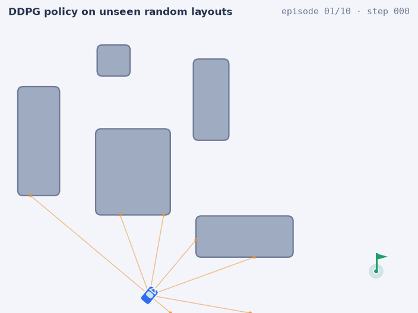
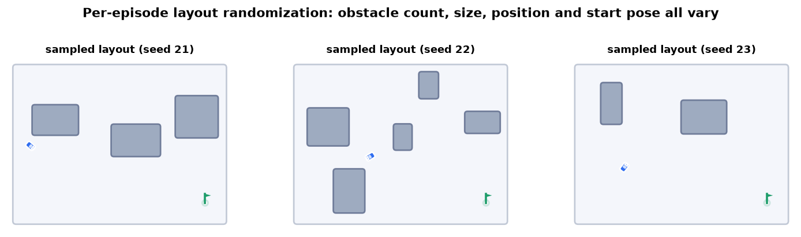
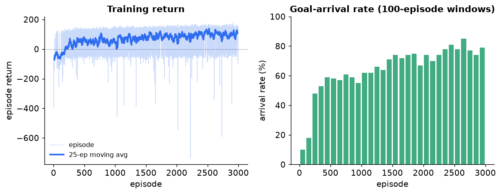
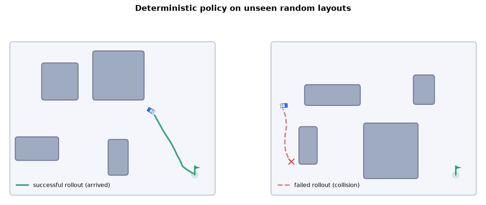

# Mobile-Robot Navigation with DDPG in Randomized Environments

[](https://github.com/nikswir/mobile-robot-navigation/actions/workflows/ci.yml)

A **DDPG** (Deep Deterministic Policy Gradient) agent that learns
point-to-point navigation from a simulated lidar. Every training episode
samples a **fresh random layout** — obstacle count, sizes, positions and the
start pose all vary, and a BFS over an inflated occupancy grid **certifies
each task is solvable** — so the policy has to learn a navigation *strategy*
instead of memorizing one route. A frontier-style **point-of-interest (POI)
heuristic** compresses the lidar field into a single goal-directed sub-target
that the policy chases.

<p align="center">
  
</p>

*The trained deterministic policy on previously unseen random layouts.*

## The task

An $800 \times 600$ bounded field with a fixed goal near the bottom-right
corner. At the start of **every** episode:

- the **obstacle count** is drawn from $\{2,\dots,5\}$, each obstacle's width
  and height from $[60, 220]$ px, positions uniformly (no overlaps, goal kept
  clear);
- the **start pose** — position and heading $\alpha \sim \mathcal{U}[0,2\pi)$
  — is drawn uniformly over the free space, at least $300$ px from the goal;
- the sampler rasterizes the layout onto an occupancy grid, inflates every
  obstacle by the robot footprint, and flood-fills free cells from the goal —
  start cells are drawn **only from goal-connected cells**, so every sampled
  task is solvable by construction.



The robot observes a 10-d state — seven normalised lidar ranges plus three
POI-relative features (bearing, **signed** heading error, distance):

$$
s = \big(\,d_1,\dots,d_7,\;\tfrac{\theta_{\text{rel}}}{2\pi},\;
\tfrac{\Delta\phi+\pi}{2\pi},\;\tfrac{\rho}{L}\,\big),
$$

and drives a throttle/steering pair $a \in [-1,1]^2$ through simple
kinematics: $\alpha \leftarrow (\alpha + a_1) \bmod 2\pi$,
$v = 10\,\tfrac{a_0+1}{2}$.

The reward is dense: forward speed plus a **potential-based progress term**
(provably policy-invariant shaping), with terminal bonuses:

$$
r =
\begin{cases}
+100 & \text{goal reached } (\rho_g < 10),\\
-50  & \text{collision or out of bounds},\\
a_0 - |a_1| + \kappa\,(\rho_g^{t-1}-\rho_g^{t}) - 1 & \text{otherwise,}
\end{cases}
\qquad \kappa = 0.1.
$$

## How it works

- **DDPG** — a deterministic actor $\mu_\theta(s)$ (10 → 2, tanh) and a critic
  $Q_\psi(s,a)$ (12 → 1), trained off-policy from a replay buffer with Polyak
  target networks; arrival is treated as **terminal** in the TD target (no
  bootstrapping past the goal).
- **Exploration** — temporally correlated Ornstein–Uhlenbeck noise, annealed
  over training.
- **POI heuristic** — candidate frontier points are spawned along free lidar
  beams and scored by clearance, goal distance and information gain; the
  minimum-score candidate becomes the current sub-target. The exploration
  memory is rebuilt every reset, since the layout changes.

## Results

The deterministic policy (no exploration noise) reaches the goal on
**74.7 % (224/300)** of previously unseen random layouts. The task
formulation matters more than the algorithm — the ablations:

| State / reward design                          | Arrival rate (300 unseen layouts) |
| ---------------------------------------------- | --------------------------------- |
| unsigned heading error, sparse arrival reward  | 16.7 %                            |
| **signed** heading error                       | 31.7 %                            |
| + potential-based progress shaping             | **74.7 %**                        |

<table>
  <tr>
    <th>Training curves (3000 episodes)</th>
    <th>Rollouts on unseen layouts</th>
  </tr>
  <tr>
    <td></td>
    <td></td>
  </tr>
</table>

The full write-up — problem formalization, method and experiments — is in the
[report PDF](https://github.com/nikswir/mobile-robot-navigation/releases/download/report/main.pdf),
compiled by CI from [report/main.tex](report/main.tex) on every change.

## Quickstart

```bash
uv sync
uv run pre-commit install
```

## Usage

Runs are configured with [Hydra](https://hydra.cc): each run is composed from
config groups under `configs/` and written to its own output directory.

Train with the default config:

```bash
uv run python -m mobile_robot_navigation.run
```

Compose a run — pick options, override any field:

```bash
uv run python -m mobile_robot_navigation.run \
    environment.max_obstacles=6 \
    training.num_episodes=1000
```

Print the composed config without running, or sweep with `--multirun`:

```bash
uv run python -m mobile_robot_navigation.run --cfg job
uv run python -m mobile_robot_navigation.run --multirun \
    environment.max_obstacles=3,5,7
```

### Configuration groups

```text
configs/
├── config.yaml           # the `defaults` list that composes a run
├── environment/ default  # layout randomization ranges, thresholds, field size
├── agent/       default  # network sizes, actor/critic learning rates
├── training/    default  # episodes, buffer, batch, γ, τ, LR schedule
└── noise/       default  # OU exploration noise (μ, θ, σ)
```

Add a variant by dropping a file into a group (e.g.
`configs/environment/dense.yaml`) and select it with `environment=dense`.

### From Python

```python
import torch

from mobile_robot_navigation import Config, train

result = train(Config(), device=torch.device("cpu"))
result.actor            # trained policy network
result.episode_rewards  # per-episode return history
```

## Reproduce the experiment

```bash
uv run python report/scripts/run_experiment.py  # train + save actor & rewards
uv run python report/scripts/eval_policy.py     # arrival rate, 300 layouts
uv run python report/scripts/make_figures.py    # regenerate report figures
uv run python report/scripts/make_gif.py        # rebuild the README demo GIF
```

Set `MRN_DEVICE=cpu` to force the device (recommended on Apple Silicon).

## Layout

```text
src/mobile_robot_navigation/
├── environment.py     MobileRobotEnv: random solvable layouts, lidar, POI, reward
├── agent.py           DDPG: actor/critic, OU noise, replay, training loop
├── lib.py             library API: Config -> TrainResult
├── run.py             Hydra CLI entry point
├── viz.py             vector renderer behind render(), figures and the GIF
└── config_schema.py   typed structured-config schema
configs/               Hydra config groups
tests/                 stage-1 CPU tests (+ stage-2 gate)
tools/                 pre-commit style checks, mutation-test helpers
report/                LaTeX report, figures, scripts, training artifacts
```

## Development

The engineering workflow — toolchain (uv), the pre-commit gate, two-stage
tests, CI — is documented in [AGENTS.md](AGENTS.md). Common tasks: `just lint`,
`just test` — run `just` for the list.

```bash
uv run pre-commit run --all-files   # lint, format, types, style checks
uv run pytest                       # stage-1 (fast, CPU) tests
RUN_STAGE2=1 uv run pytest          # + heavy tests
```

See [docs/architecture.md](docs/architecture.md) for how a training run flows
through the package.

## License

MIT — see [LICENSE](LICENSE).
