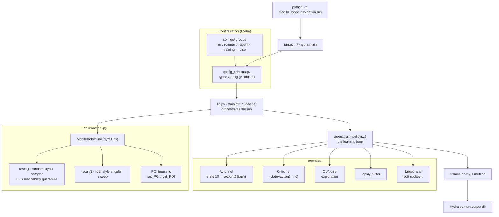

# Architecture

How a training run flows through the package, from the Hydra entry point to the
trained policy. Each node names the module that owns it; GitHub renders the
diagram below natively (no build step). Keep it in sync by hand when the
pipeline changes — it is a map, not a generated artifact.

## The flow

- **`run.py`** is the CLI entry only — `@hydra.main` composes the config from
  `configs/`, validates it against the typed schema, and hands off to the
  library. Importing the package never imports it.
- **`config_schema.py`** declares the typed `Config` (env and agent
  hyper-parameters: learning rates, `gamma`, soft-update `tau`, buffer size,
  OU-noise `theta`/`sigma`, episode counts) so a bad run fails fast.
- **`lib.py`** is the orchestration layer: it builds the `MobileRobotEnv`
  environment and the agent, then drives `agent.train_policy` over episodes and
  returns the trained actor and reward history. It is free of file I/O —
  `run.py` is what writes the checkpoint into the Hydra per-run output directory.
- **`environment.py`** holds the `MobileRobotEnv` `gym.Env`. Every `reset()`
  samples a fresh task: a random number of rectangular obstacles with random
  sizes and positions, plus a random start pose (position and heading). A
  breadth-first search over an inflated occupancy grid (`free_grid` /
  `reachable_cells`) guarantees each sampled layout is solvable — a
  collision-free corridor from start to target always exists. `scan()` casts
  rays over a fixed set of angles (a lidar-style sweep) to measure obstacle
  distances, and the POI heuristic (`set_POI` / `get_POI`) seeds candidate
  waypoints and scores them by distance-to-robot and distance-to-goal to bias
  exploration toward useful regions; the exploration memory is rebuilt per
  episode since the layout changes. The agent observes a 10-dimensional state
  and emits a 2-dimensional continuous action.
- **`agent.py`** holds DDPG: an **Actor** (state 10 → 2 actions, `tanh`-bounded)
  and a **Critic** (state+action → scalar Q). Exploration noise comes from an
  **Ornstein-Uhlenbeck process** (`OUNoise`); transitions are stored in a
  **replay buffer**; learning uses **target networks** updated by a soft
  Polyak update with coefficient `tau`.

The public surface (`__all__` in `__init__.py`) is the training entry and
result types re-exported from `lib.py`; `test_api_stability.py` pins their
signatures so the contract can't drift silently.
